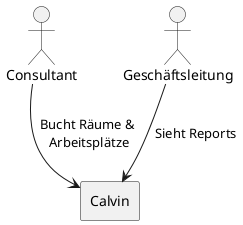

# 3. Kontextabgrenzung

## Überblick

Das Calvin-System ist INNOQs internes Raum- und Arbeitsplatzbuchungssystem. Das System operiert in einem minimalen Systemkontext.

## Fachlicher Kontext

| Nachbarsystem / Akteur | Beziehung |
|------------------------|-----------|
| **INNOQ Mitarbeiter (Consultant)** | Sucht und bucht Räume & Arbeitsplätze |
| **Geschäftsleitung** | Ruft Auslastungsreports ab |

## Technischer Kontext

<!-- Technische Schnittstellen und Protokolle zu externen Systemen -->

| Schnittstelle | Protokoll / Format | Richtung |
|---------------|--------------------|----------|
| | | |
