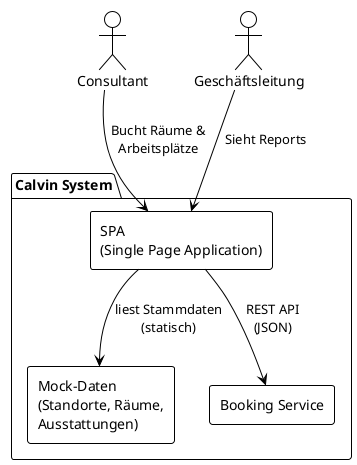

# 5. Bausteinsicht

## Ebene 1: Whitebox Gesamtsystem

Das Calvin-System besteht aus einer Single Page Application (SPA) und einem separaten Booking Service. Stammdaten (Standorte, Räume, Ausstattungen) sind im Prototypen als Mock-Daten in der SPA hinterlegt; ein eigener Ressource-Service wird erst für den produktiven Betrieb implementiert (siehe [ADR-003](adrs/ADR-003-ressource-service-als-mock-in-spa.md)).

### Enthaltene Bausteine

| Baustein | Verantwortlichkeit | Quellcode |
|----------|-------------------|-----------|
| **SPA** | Benutzeroberfläche für Buchungen, Kalenderansichten und Reports | `frontend/` |
| **Mock-Daten** | Statische Stammdaten für Standorte, Konferenzräume und Ausstattungen (Prototyp) | `frontend/src/data/` |
| **Booking Service** | Buchungslogik, Validierung, Konfliktprüfung, Auswertungsdaten | `backend/` |

### Schnittstelle: SPA → Booking Service

Die SPA kommuniziert mit dem Booking Service über eine REST API (JSON über HTTPS). Die API-Spezifikation wird als OpenAPI-Dokument im Backend gepflegt. Der Booking Service arbeitet ausschließlich mit den Raum-IDs aus den Mock-Daten und verwaltet keine eigenen Ressourcen-Stammdaten.

## Ebene 2: SPA

<!-- Interne Struktur der Single Page Application -->

## Ebene 2: Booking Service

<!-- Interne Struktur des Booking Service -->
