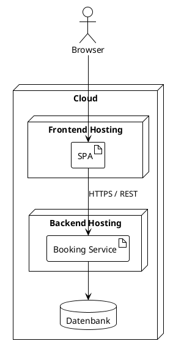

# 7. Verteilungssicht

<!-- Beschreibung der technischen Infrastruktur und der Zuordnung von Bausteinen zu Infrastrukturelementen (Deployment-Diagramm). -->

## Infrastruktur

<!-- Auf welcher Plattform / in welcher Cloud wird Calvin betrieben? -->

## Deployment-Diagramm

## Qualitätsmerkmale der Infrastruktur

| Merkmal | Maßnahme |
|---------|----------|
| Scale-to-Zero (Hosting-Kosten) | |
| Verfügbarkeit 98 % | |
